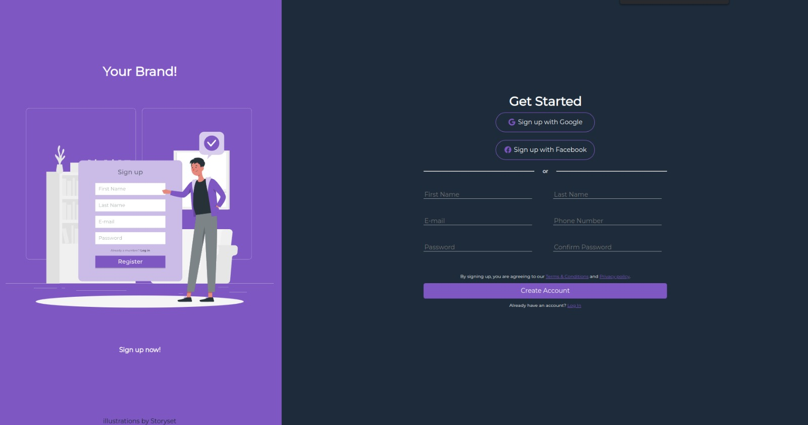

# Sign-up-Form

# Learnigns

- Used SVG for the first time, changed the color applying filters.
- Used forms for the irst time, learned how to style them, validate the info, remove the default error, adn style it depending on the validation.
- Used positioning for the first time, to maintain the ilustration credits to the baseline of the web.
- Learned to make responsive web pages with @media.
- 
